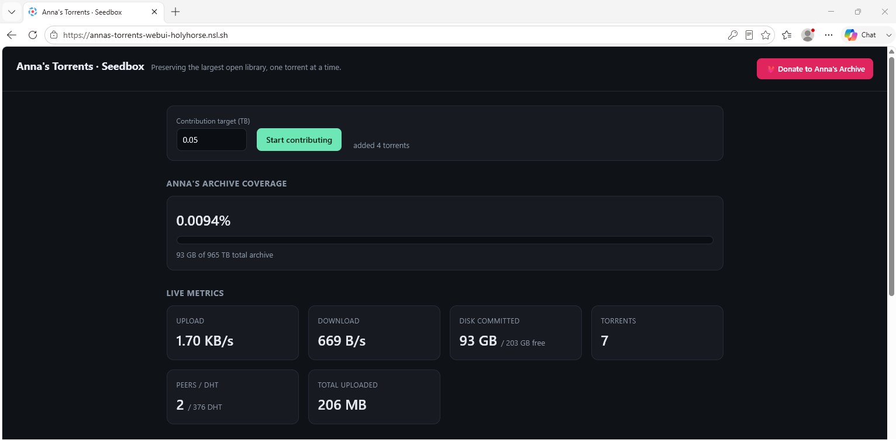

# annas-torrents-webui

A web interface for [**annas-torrents**](https://github.com/cparthiv/annas-torrents) — turning the CLI-only tool for seeding [Anna's Archive](https://annas-archive.pk) into a friendly dashboard you can drive from your browser.

> Anna's Archive is the largest open library in human history. It stays alive because volunteers seed its torrents. This project makes it easy to **choose how much you contribute, watch what you're actually sharing, and show it off.**



---

## Why a Web UI?

The original `annas-torrents` is a command-line script: you run `python main.py`, type how many terabytes you want to target, and it downloads the matching `.torrent` metadata files into a `/torrents` folder. You then load those into a BitTorrent client (qBittorrent) yourself and hope you set everything up right.

That works, but it's opaque. Once the torrents are seeding you have no easy view of:

- How much of Anna's Archive you're actually preserving
- How much disk you've committed vs. how much is left
- Whether you're uploading, and how fast
- How many peers are relying on your copy

This web UI wraps the same torrent-selection logic in a dashboard that **parametrizes the contribution, surfaces live metrics, and lets you share your impact.**

---

## Features

### 🎛️ Parametrize your contribution
- Set a **target size** (in TB/GB, decimals supported — e.g. `0.05 TB` = 50 GB).
- One click to fetch the prioritized `.torrent` list from Anna's Archive and **start seeding** — either via the embedded libtorrent client, or by pushing into an existing **qBittorrent**.
- Collection filtering (books, papers, comics, metadata) is already supported by the backend and coming to the UI.

### 📊 See what you're actually sharing
- **Coverage** — how much of the total Anna's Archive dataset your seeded torrents represent, shown as a percentage and absolute size.
- **Disk used** — space committed by your active torrents, and headroom remaining on the volume.
- **Bandwidth** — live upload / download rates and cumulative totals.
- **Swarm health** — seeders and leechers per torrent, so you can see who depends on you.
- Per-torrent and aggregate views, refreshed in near real time.

### 📣 Share your impact & support Anna's Archive
- **Share buttons** for X, Bluesky, Mastodon, Reddit, Telegram, WhatsApp, Facebook, LinkedIn, Email, and copy-to-clipboard — plus the native mobile share sheet (Web Share API). The message explains *why* preserving Anna's Archive matters and embeds your live contribution.
- Share links point to a **read-only vantage page (`/view`)** of your live seedbox, so others see your real-time contribution — not your control panel.
- A **❤️ Donate to Anna's Archive** button linking straight to their donation page.

---

## How It Works

```
┌────────────────┐   HTTP + SSE   ┌──────────────────────────────┐
│   Web UI       │◄──────────────►│  Backend (FastAPI)           │
│   (browser)    │                │  selection · metrics · coverage│
└────────────────┘                └───────────┬──────────────────┘
                                              │
                    ┌─────────────────────────┴─────────────────────────┐
                    ▼                                                   ▼
         TORRENT_BACKEND=libtorrent                      TORRENT_BACKEND=qbittorrent
         (embedded session seeds)                        (Web API → your qBittorrent)
```

1. **Parametrize** — you set target size (and later, collections) in the UI.
2. **Select** — the backend calls Anna's Archive `generate_torrents`, downloads matching `.torrent` files.
3. **Seed** — either the **embedded libtorrent** session (default), or **your qBittorrent** via Web API.
4. **Observe** — live stats + Anna's Archive coverage, streamed to the UI over SSE.
5. **Share** — the share button turns your live stats into a post.

---

## Tech Stack

| Layer     | Choice                                                        |
|-----------|---------------------------------------------------------------|
| Frontend  | Single static page (vanilla JS + SSE) — metric cards, coverage bar, sharing, `/view` vantage page |
| Backend   | Python + FastAPI — provisioning, live metrics, coverage       |
| Torrent   | **libtorrent** (default, embedded) **or** [qBittorrent](https://www.qbittorrent.org/) Web API |
| Delivery  | Single Docker image / Compose service, no auth                |

---

## Getting Started

### Prerequisites
- Docker.
- Disk space for whatever you choose to seed.
- For **libtorrent** (default): a forwarded BitTorrent port (default `6881` TCP+UDP).
- For **qBittorrent**: Web UI enabled; optionally “Bypass authentication for clients on localhost”.

### Run with Docker Compose (libtorrent — default)

```bash
git clone https://github.com/cparthiv/annas-torrents-webui
cd annas-torrents-webui
docker compose up -d --build
```

Open **`http://localhost:8080`**, set a contribution target (TB), click **Start contributing**.

### Run with an existing qBittorrent

```env
TORRENT_BACKEND=qbittorrent
QBIT_URL=http://host.docker.internal:8080
QBIT_USER=admin
QBIT_PASS=
QBIT_CATEGORY=Anna's Archive
WEB_PORT=8090
```

Then `docker compose up -d --build`. The dashboard imports torrents already in that category and can provision new ones into it.

> ⚠️ **No authentication on this UI.** Keep it on a trusted network
> (LAN / VPN / behind a reverse proxy). Don't expose the UI port to the internet.

### Ports & volume

| What            | Value                                                        |
|-----------------|--------------------------------------------------------------|
| Web UI          | `8080/tcp` (override with `WEB_PORT`)                        |
| BitTorrent      | `6881` TCP+UDP when using libtorrent; otherwise qBittorrent's ports |
| Data volume     | `./data` → `/data` — `.torrent` files (+ content/resume for libtorrent) |

### Configuration (environment variables)

| Variable           | Default                              | Description |
|--------------------|--------------------------------------|-------------|
| `TORRENT_BACKEND`  | `libtorrent`                         | `libtorrent` or `qbittorrent` |
| `TORRENT_PORT`     | `6881`                               | libtorrent listen port |
| `DATA_DIR`         | `/data`                              | Content / `.torrent` / resume (libtorrent) or `.torrent` cache (qBit) |
| `QBIT_URL`         | `http://host.docker.internal:8080`   | qBittorrent Web UI base URL |
| `QBIT_USER`        | `admin`                              | Web UI username |
| `QBIT_PASS`        | *(empty)*                            | Web UI password (or enable localhost bypass) |
| `QBIT_CATEGORY`    | `Anna's Archive`                     | Category to import / add into |
| `QBIT_SAVE_PATH`   | *(empty)*                            | Save path as qBit sees it; empty → qBit default |
| `PUBLIC_URL`       | *(unset)*                            | Public base URL for share links |

---

## Roadmap

- [x] Backend selection module (Anna's Archive `generate_torrents`, mirror fallback)
- [x] Embedded libtorrent session for live disk/bandwidth/swarm metrics
- [x] Optional qBittorrent Web API backend (`TORRENT_BACKEND=qbittorrent`)
- [x] Anna's Archive totals → coverage percentage (by `data_size`)
- [x] Dashboard UI with live metric cards + coverage bar (SSE)
- [x] Multi-network sharing (X, Bluesky, Mastodon, Reddit, Telegram, WhatsApp, Facebook, LinkedIn, Email, copy) + native Web Share API
- [x] Read-only vantage page (`/view`) + Donate to Anna's Archive button
- [x] Single Docker image / Compose delivery
- [ ] Collection filtering in the UI (backend already supports it via `top_level_group`/`group`)
- [ ] Bandwidth/coverage sparklines (in-memory history)
- [ ] Per-torrent controls (pause/remove) and global up/down rate limits

---

## A Note on Safety

This app **downloads and seeds actual content** (via libtorrent or qBittorrent). Distributing certain materials may not be legal in all jurisdictions. **Use a VPN** when running it, and seed at your own risk. You are responsible for what you choose to contribute. The UI ships with **no authentication** — do not expose it to the public internet.

---

## Credits

- Built on top of [**cparthiv/annas-torrents**](https://github.com/cparthiv/annas-torrents).
- For the benefit of [**Anna's Archive**](https://annas-archive.pk) and everyone who keeps it alive.

## License

See [LICENSE](./LICENSE).
